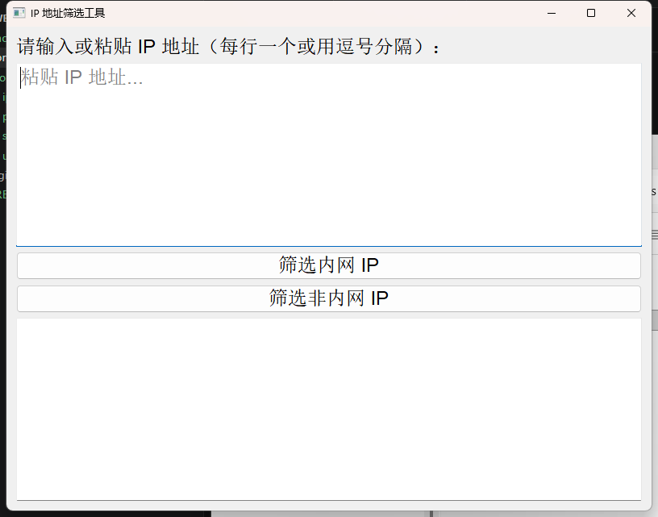
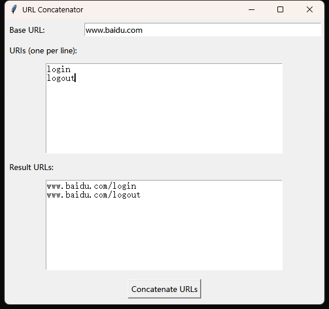
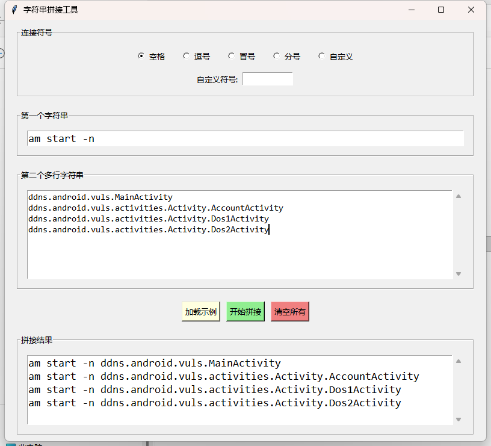

# 项目简介
1. 本项目旨在提供一套实用的工具集，帮助安全研究人员和开发者更高效地进行逆向工程、调试和安全分析工作。
2. 目前包含以下功能模块：
   - 

  

# 目录

- [1. hook自吐脚本](#hook)
- [2. ip、url、字符串处理等工具](#tools)

  

# 1. hook自吐脚本

使用方法：

    hook_js文件夹下，结合frida使用即可；
    有Toast、String、hashMap、ArrayList等多种hook脚本，后续会继续增加；

  

# 2. ip、url、字符串处理等工具

使用方法：

    tools文件夹下，有ip提取、url拼接、字符串拼接等工具；

效果如下：

IP提取工具：

 

URL拼接工具：

 

字符串拼接工具：

 
PS：工具后续会继续完善和增加功能，敬请期待！欢迎大家提出意见和建议！